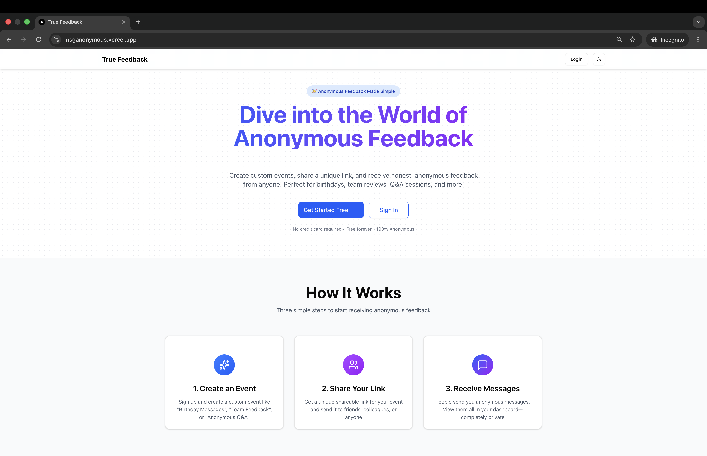
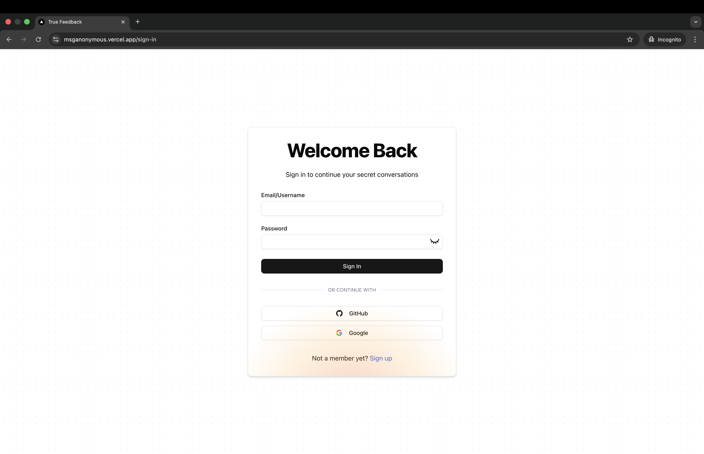
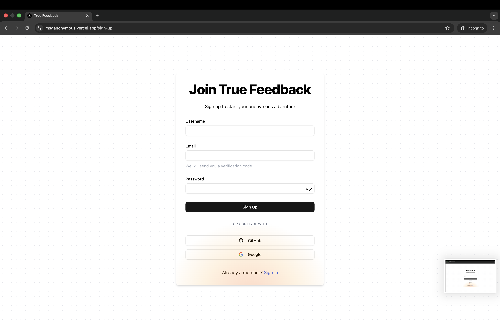
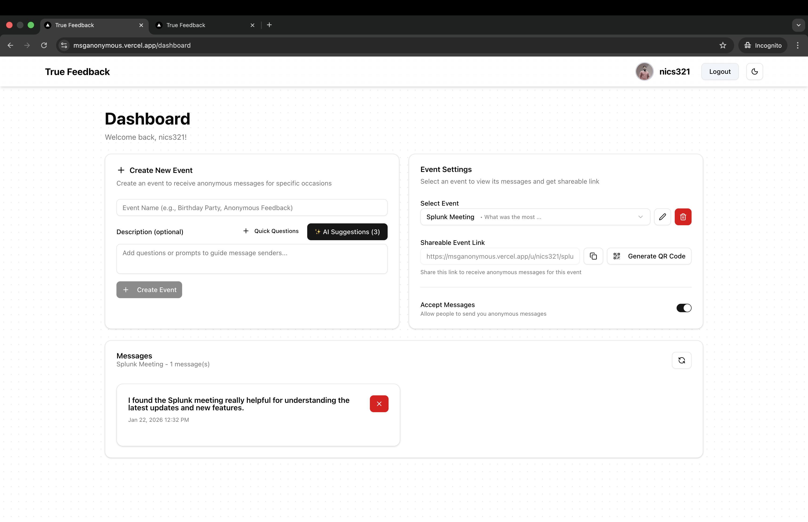
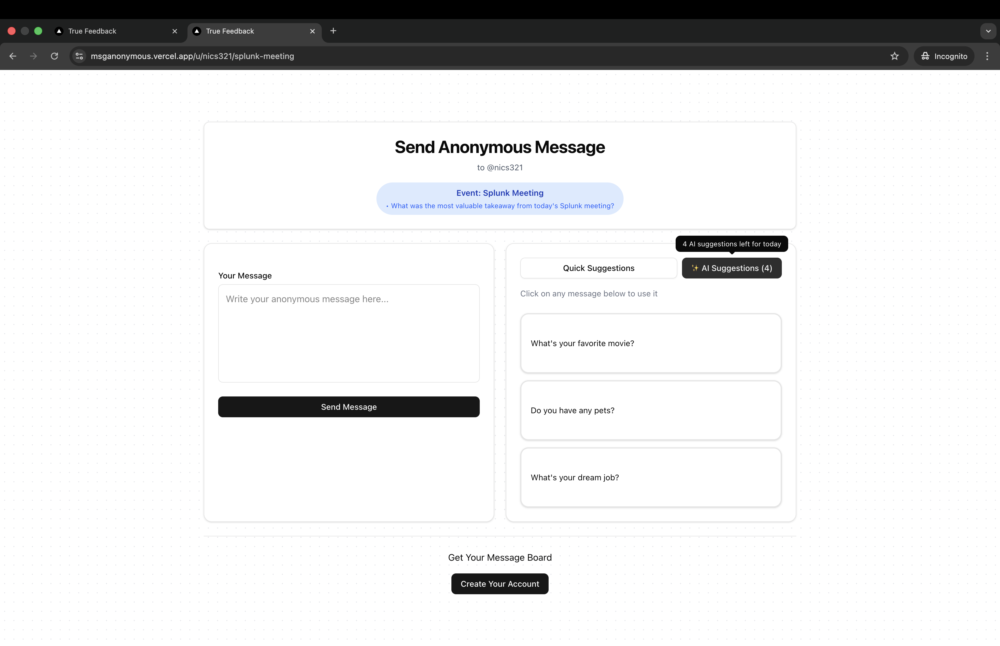

# MSGAnonymous

>A privacy-focused platform for sending and receiving anonymous messages, built with Next.js, TypeScript, and MongoDB.

---

## 📝 Project Overview

**MSGAnonymous** allows users to create events and receive anonymous messages from anyone. It features user authentication, event management, AI-powered message suggestions, and robust rate limiting to prevent spam. The project is designed for privacy, security, and ease of use.

---

## 🚀 Features

- User authentication (sign up, sign in, email verification)
- Create, update, and delete events
- Public event pages for anonymous message submission
- AI-generated message suggestions
- Rate limiting and anti-abuse protections
- QR code generator for event sharing
- Responsive UI with modern design
- Admin dashboard for managing messages and events

---

## 🛠️ Tech Stack

- **Frontend:** Next.js (App Router), TypeScript, Tailwind CSS
- **Backend:** Next.js API routes, MongoDB (via Mongoose)
- **Authentication:** NextAuth.js
- **Email:** Resend API
- **AI:** OpenAI API (for message suggestions)
- **Other:** Zod (validation), Rate Limiter, Fingerprinting

---

## 🏗️ Architecture Diagram

```
┌────────────┐     ┌──────────────┐     ┌─────────────┐
│  Browser   │<--->│ Next.js App  │<--->│ MongoDB     │
│ (User)     │     │ (API Routes) │     │ (Database)  │
└────────────┘     └──────────────┘     └─────────────┘
		  │                 │
		  │                 └──> NextAuth, Resend, OpenAI
		  │
		  └──> QR Code, AI Suggestions, Rate Limiting
```

---

## 📸 Screenshots / GIFs

> _Add your screenshots or GIFs here_






---

## ⚙️ Setup Steps

1. **Clone the repository:**
	```bash
	git clone https://github.com/yourusername/msganonymous.git
	cd msganonymous
	```
2. **Install dependencies:**
	```bash
	npm install
	# or
	yarn install
	```
3. **Configure environment variables:**
	- Copy `.env.example` to `.env.local` and fill in your MongoDB URI, NextAuth secrets, Resend API key, and OpenAI key.
4. **Run the development server:**
	```bash
	npm run dev
	```
5. **Open [http://localhost:3000](http://localhost:3000) in your browser.**

---

## 💡 What I Learned / Tradeoffs

- **Authentication:** NextAuth.js made it easy to implement secure authentication, but customizing flows (like email verification) required extra work.
- **Rate Limiting:** Implementing robust rate limiting and fingerprinting was essential to prevent abuse, but balancing user experience and security was tricky.
- **AI Integration:** Using OpenAI for message suggestions added value, but required careful prompt engineering and cost management.
- **Architecture:** Keeping the code modular (separating API, components, helpers, etc.) improved maintainability.
- **Tradeoffs:** Chose serverless API routes for simplicity, but for high scale, a dedicated backend might be better. Used MongoDB for flexibility, but relational DBs could offer stronger consistency for some use cases.

---

## 📄 License

MIT
